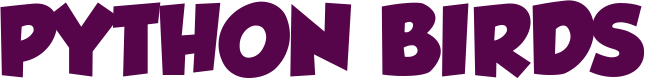

  

<h1 align="center">
  

   

  
</h1>
 

# 📌 Sobre

Repositório ao módulo introdutório do [Bootcamp DevPro](https://pythonpro.com.br/).

Neste módulo foram ensinados os conceitos de programação Procedural e Orientação a Objetos em Python, sendo desenvolvida uma versão simplificada do jogo Angry Birds.

# 📌 Conteúdo

### ➡️ [Programação Procedural](./paradigma-procedural)

**Tipos Básicos**
- Tipo Inteiro 
- Tipo Float 
- Variável e Atribuição 
- Tipo Booleano 

**Desvios Condicionais**
- Containers e Iteração
- String, Dir e Help 
- Lista e Range 
- Tupla e Id 
- Acesso, Tamanho e Fatiamento 
- While 
- For 
- Dicionários/Mapas 
- Iteração em Dicionário 

**Modularização**
- Função e PEP 8 
- Parâmetros de Função 
- Parâmetros Variáveis 
- Módulo 
- Debug 
- Import e __name__ 
- Pacote 
- Docstring e Comentário 
- Contagem de Caracteres com Lista 
- Contagem de Caracteres com Dicionário 
- Retrospectiva: Paradigma Procedural 
- Programação se Aprende pelos Dedos! 

#### ➡️ [Orientação a Objetos](./poo)

**Classe e Composição**
- Git no Windows 
- Git no Ubuntu 
- Git no Mac 
- Github e Setup 
- Classe 
- Commit e Push 
- Método 
- Atributo de Dado 
- Atributo Complexo 
- Atributo Dinâmico 
- Atributo de Classe 
- Método de Classe 
- Composição 
- Doctest 
- Implementação do Motor 
- Implementação da Direção 
- Implementação do Carro 
- Fase e Atores 

**Herança**
- Herança Simples 
- Unittest 
- Sobrescrita de Atributo 
- Sobrescrita de Método 
- Tipos de Teste 
- List Comprehension 
- Método Protegido 
- Ciclo de Vida de Objetos 
- Tratamento de Exceção 
- Fase Completa 
- Posição de Ator 
- Colisão entre Atores 
- Porco e Obstáculo 
- Classe Pássaro 
- Controle de Lançamento 
- Lançamento Vertical 
- Lancamento Horizontal 
- Gran Finale 
- Retrospectiva: Orientação a Objetos 

# 👩‍💼 Author

<b>Nádia Ligia, budding back-end developer.</b>

&nbsp;
&nbsp;

 

# 📝 License

This project is under de MIT licence. Look at the file [LICENSE](./LICENSE) for more information.